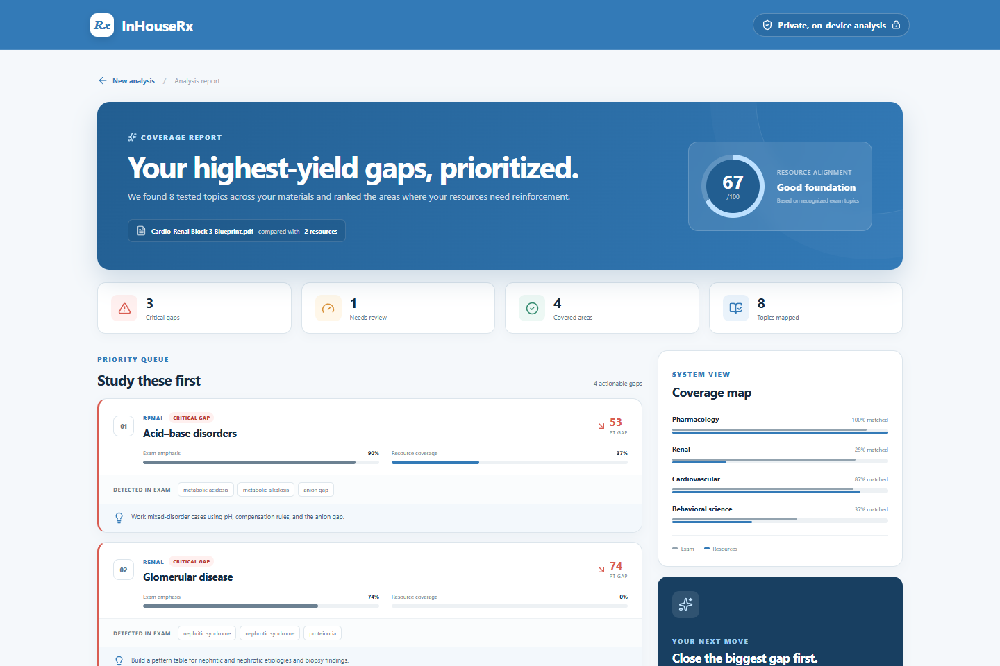
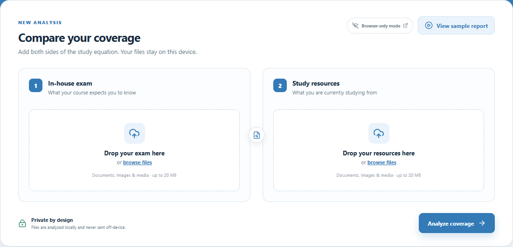
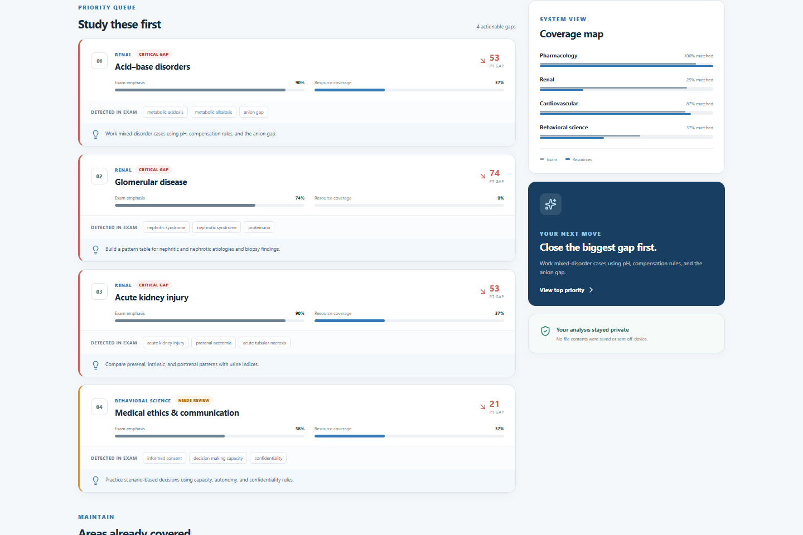

# InHouseRx

[](LICENSE)

InHouseRx is a privacy-first medical study coverage analyzer. It compares an in-house exam or blueprint with third-party study resources, identifies topics that are missing or underrepresented, and turns those differences into a prioritized study plan.

[](https://github.com/AKaturu/InHouseRx/releases/download/v0.2.0/inhouserx-demo.webm)

▶ **[Watch the 30-second InHouseRx demo](https://github.com/AKaturu/InHouseRx/releases/download/v0.2.0/inhouserx-demo.webm)**

## Product tour

### Private comparison workspace



### Explainable, prioritized gaps



## What the MVP includes

- Browser-local extraction for PDF, DOCX, PPTX, TXT, and Markdown files.
- Optional [Local Content Transcriber](https://github.com/AKaturu/local-content-transcriber) integration for scanned documents, images, audio, and video.
- A transparent, versioned medical-topic taxonomy.
- Exam-emphasis and resource-coverage scoring with evidence terms.
- Prioritized critical and moderate gaps, system-level coverage, and study actions.
- A built-in sample report for exploring the product without private files.
- Responsive, accessible UI branded with the `#337ab7` InHouseRx theme.

Uploaded content stays on the device and is not transmitted to a cloud service or persisted. Standard documents are read directly in the browser; companion-assisted files travel only to a loopback service on the same machine.

## Run locally

Prerequisites: Node.js 20+ and pnpm.

```bash
pnpm install
pnpm dev
```

Open the local URL printed by Vite. Choose **View sample report** for the fastest product tour.

### Desktop application

InHouseRx also runs as a secure Electron desktop application on Windows, macOS, and Linux:

```bash
pnpm dev:desktop
```

Build a native package on its matching operating system with `pnpm desktop:win`, `pnpm desktop:mac`, or `pnpm desktop:linux`.

The public [GitHub Releases page](https://github.com/AKaturu/InHouseRx/releases) provides the Windows installer, universal macOS disk image/ZIP, and Linux AppImage/deb packages. Current preview packages are unsigned, so Windows SmartScreen or macOS Gatekeeper may ask for confirmation. Certificate-backed signing and Apple notarization are planned release-hardening steps.

The optional Local Content Transcriber remains a separate local service. Start it before InHouseRx when you want OCR or audio/video transcription; ordinary PDF, Word, PowerPoint, text, and Markdown analysis works without it.

## Optional local OCR and media companion

InHouseRx can compose the separately tested Local Content Transcriber engine for scanned PDFs, PNG/JPEG/TIFF/WebP images, common audio files, and MP4/MOV/MKV/WebM video.

```powershell
python -m venv .venv-companion
.venv-companion\Scripts\Activate.ps1
python -m pip install -r companion\requirements.txt
python companion\server.py
```

Keep the companion terminal running and start InHouseRx in another terminal. The upload workspace reports **OCR + media ready** when the loopback connection succeeds. See [`companion/README.md`](companion/README.md) for configuration and model notes.

## Verify

```bash
pnpm test
pnpm test:desktop
pnpm test:companion
pnpm lint
pnpm build
```

Coverage can be inspected with `pnpm test:coverage`.

Project screenshots and the demo video can be regenerated from the production build with `pnpm media:capture`. Set `PLAYWRIGHT_BROWSER_PATH` if Edge, Chrome, or Chromium is not installed in a standard location.

## Project map

- `src/services/documentExtractor.ts` — local format adapters and validation.
- `src/services/localTranscriberClient.ts` — loopback-only companion contract.
- `companion/` — secure FastAPI composition layer for Local Content Transcriber.
- `src/services/analysisEngine.ts` — deterministic coverage and priority calculations.
- `src/domain/topicTaxonomy.ts` — current topic/alias definitions.
- `src/components/` — upload, processing, and report experiences.
- `docs/requirements.md` — accepted MVP scope and criteria.
- `docs/architecture.md` — components, data flow, and failure modes.
- `docs/media/` — real-application screenshots and the captioned demo video.

## Current limitations

- OCR and media formats require the optional local companion and its relevant engine/model.
- Matching is lexical, so paraphrases can be missed.
- Coverage measures textual representation, not teaching quality or factual correctness.
- The taxonomy is an initial pre-clinical set and should be reviewed with curriculum experts before production use.

InHouseRx is educational study-planning software. It does not predict scores and is not affiliated with NBME or NBOME.

## License

Released under the [MIT License](LICENSE).
